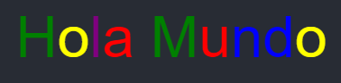

# Animación de Texto "Hola Mundo"

Este proyecto es una simple animación de texto que muestra "Hola Mundo" en colores cambiantes, desarrollada utilizando **JavaScript**, **HTML** y **CSS**. El texto se despliega de forma dinámica, con cada letra apareciendo en un color diferente.

  

## Descripción

- La animación muestra la frase "Hola Mundo" letra por letra.
- Cada letra aparece en uno de cinco colores diferentes de manera cíclica.
- El proyecto utiliza un enfoque basado en eventos y temporizadores para crear la animación fluida.

## Archivos

- `index.html`: Contiene la estructura básica de la página.
- `index.css`: Define los estilos visuales, incluyendo los colores del texto y el diseño de la página.
- `index.js`: Contiene la lógica de la animación y el manejo de eventos.

## Cómo usar

1. Descarga los archivos del proyecto.
2. Abre el archivo `index.html` en tu navegador.
3. Observa la animación del texto "Hola Mundo" en la pantalla.

## Tecnologías utilizadas

- **HTML5**
- **CSS3**
- **JavaScript (ES6)**

## Notas
Este proyecto fue desarrollado como un ejercicio introductorio y puede no contener mejoras avanzadas. Es ideal para aprender sobre animaciones simples en la web.

## Licencia

Este proyecto está bajo la [Licencia MIT](https://opensource.org/licenses/MIT). Puedes usar, copiar, modificar y distribuir el software bajo las condiciones de esta licencia. Para más detalles, consulta el archivo [LICENSE](LICENSE) en la raíz del proyecto.

## Contribuir al Proyecto
Para conocer cómo contribuir, revisa nuestras [pautas de contribución](https://github.com/sam324sam/sam324sam/blob/main/CONTRIBUTING.md).
